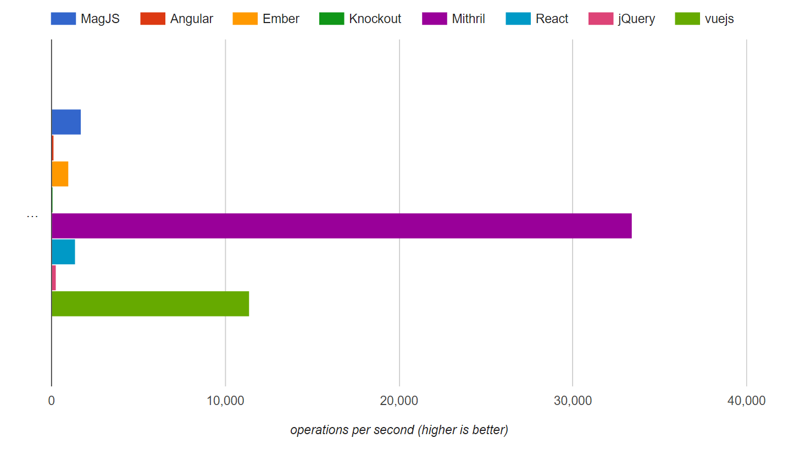
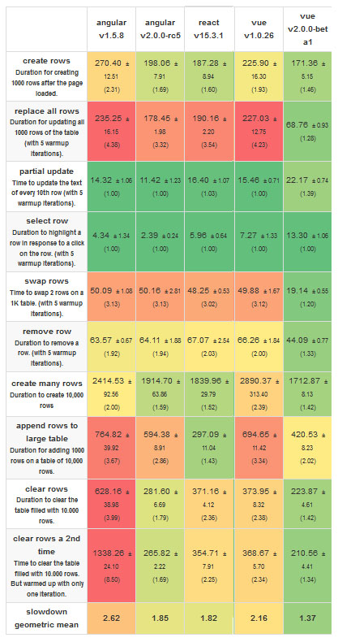

## 背景
    移动端越发重要，但mobileWeb用户体验一直欠友好，为了彻底解决历史遗留问题，决定从三大主流框架中选其中之一，
    更换现有框架angular1，因为它天生没有对移动端作优化。

## 三大框架
1. angular2--
    NG2是一个all-in-one的框架，它整合了很多各种先进的理念，搭配TypeScript非常适合有后台开发经验朋友的学习。
    想比angular1，它用zone.js代替了脏检测，性能提高了500倍。对移动端方面，他们也做了很多优化。

2. React--
    React融合JSX、虚拟DOM、单向数据流、组件，大受开发者喜爱，形成一个庞大的社区。React的JSX虚拟 DOM 使得
    界面构建变得非常简单，单向数据流也可以很好的区分开界面的数据作用域问题，和 NG 最大的不同是 R 基本上没有
    用于业务逻辑的内置特性。可以配合router、redux进行大型应用开发

3. Vue2--
    Vue2把双向绑定和React的组建话融合在一起，他包含看数据绑定和虚拟DOM，比angular轻便不少而且性能强大。它的渐进式
    理念让它既可以开发轻量级应用也可以配合vue-router、vuex开发大型应用。2016年增长势头迅猛，开发社区快速壮大。

## 性能对比

看这测试，这个测试的原理是针对每一个前端框架，创建一个数组模型到视图的绑定，并重复以下操作：清空列表数据，
然后循环对数组插入100个元素。重复操作一段时间，最后将比较他们之间每秒可以达到的操作次数。他比较了包括
 Angular，React，Vue 在内的数个流行框架。
 

 在这幅图中，你几乎看不到 Angular 的数据，因为他每秒只能进行 100 次左右的操作。React 的操作数大概在 
 1000 - 2000 之间，而 Vue 则在 10000 次以上。

    
    这个是基于benchmark的测试数据，最下面一行分值越小越好。从数据看到，angular2与react性能相当，vue以1.37领先
    他们两个。除数据，还可以去这看具体效果。
    （https://swizec.com/blog/animating-svg-nodes-react-preact-inferno-vue/swizec/7311）

    总结一点，渲染性能上Vue2 > Angular2 > React 

## 其他分析
   1. 开发体验-- Vue容易上手，最聚亲和度，可以使用vue-cli和webpack搭建，template语法与NG相似。React的JSX语法
   对开发者并不友好，工具配置麻烦，学习成本比较高。angular2发布不久，需要配合TypeScript、rxjs使用，也需要一定的
   学习时间。
   2. 社区生态-- React目前最活跃，有一套成熟的方案 React+react-router-redux，各种便利工具，非常方便。Vue2社区
   比React小，2016成长很快，现在作者专职参与框架开发，估计会明年继续疯长，官方全套方案很实用，而且在国内很火。
   angular2出生不久，推广不够，社区比较小，相关技术文章不多，GitHub关注量也是最小的。

# 选择
        没有选择就没有痛苦。若要选择，从上面的分析可以看出，Vue是个不错的选择。它拥有强悍的性能，而且他的
    runtime-only 包大小 min+gzip 过后只有 16kb，即便把 vue-router 和 vuex 都包含进去也只有 26kb，极其
    适合移动端这种网络环境复杂的情况，也有很多成功的案例。
        它相对其他两个框架门槛偏低，中文文档健全，方便上手投入开发。国人对它热情高涨，方便公司吸纳相关人才。
    
    官方网站：http://cn.vuejs.org/
    官方文档：http://cn.vuejs.org/v2/api/
    vue-router文档：https://router.vuejs.org/zh-cn/
    vuex文档：https://vuex.vuejs.org/zh-cn/
    vue-cli文档：https://github.com/vuejs/vue-cli

