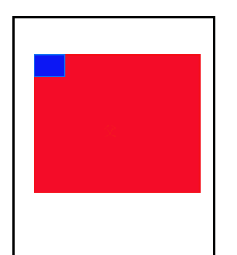
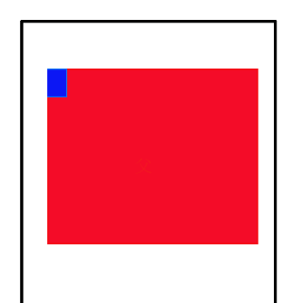

### android上定位不能超出父容器
在网页布局中,position定位非常实用,Weex也支持这个属性.但是在使用中,我发现一点不同.  
在android上,定位如果超出父盒子的内容区域会被隐藏掉,在IOS则不会,什么意思呢
  
红色的是父Div,蓝色的是子Div,如果子Div布局代码如下
```css
.parent{
    width:300px;
    height: 400px;
    position: relative;
}
.child{
    width: 100px;
    height: 100px;
    position: absolute;
    left: 0;
    top: 0;
}

```
上面的常规代码,一看就懂,效果也正常,再看看下面的写法

```css
.parent{
    width:300px;
    height: 400px;
    position: relative;
}
.child{
    width: 100px;
    height: 100px;
    position: absolute;
    left: -50px;
    top: 0;
}

```
效果图如下  
  
留意子Div,有一半的内容被隐藏掉.这就是Weex和网页不同的地方,最奇怪的是IOS并不会隐藏

### 解决办法
1. 在IOS中添加overflow:hidden,Weex的ios支持这熟悉
2. 通过添加空白div撑开父Div