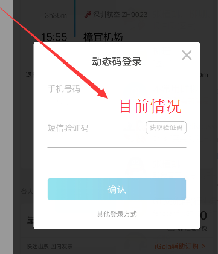
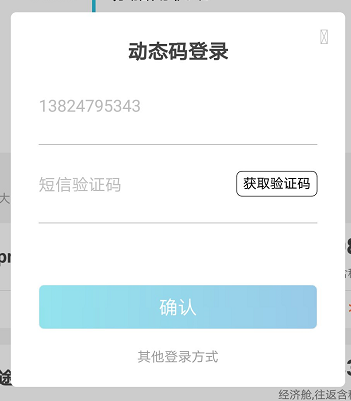

#### opacity 在安卓导致width属性不饱和
  
验证码的边框在android上凹凸不平,在IOS却没有问题,折腾一轮后发现是opacity导致的,看代码
```
  .validation-code-box {
    width: 145px;
    height: 46px;
    opacity: 0.5;
    border-radius: 10px;
    justify-content: center;
    align-items: center;
    border-style: solid;
    border-width: 2px;
    border-color: rgba(70,70,70,1);
  }
  .validation-code-box-active {
    background-color: transparent;
    opacity: 1;
    border-style: solid;
    border-width: 2px;
    border-color: #000000;
  }
```
通过opacity控制验证码框颜色的深浅,我尝试换一种方法,直接使用浅灰色来表示颜色,active的时候用黑色,验证码边框完整展示  

```
  .validation-code-box {
    width: 145px;
    height: 46px;
    border-radius: 10px;
    justify-content: center;
    align-items: center;
    border-style: solid;
    border-width: 1px;
    border-color: rgba(190,190,190,1);
  }
  .validation-code-box-active {
    background-color: transparent;
    border-style: solid;
    border-width: 1px;
    border-color: #000000;
  }
```

> opacity可能还会影响其他东西,需要谨慎