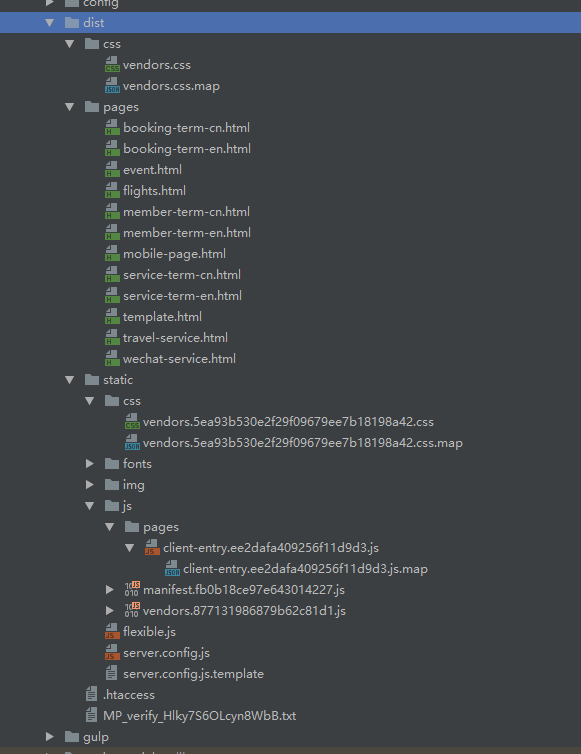
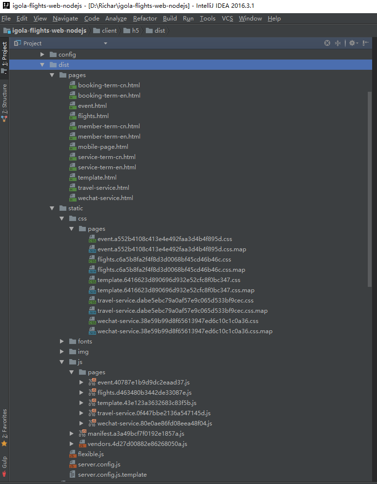
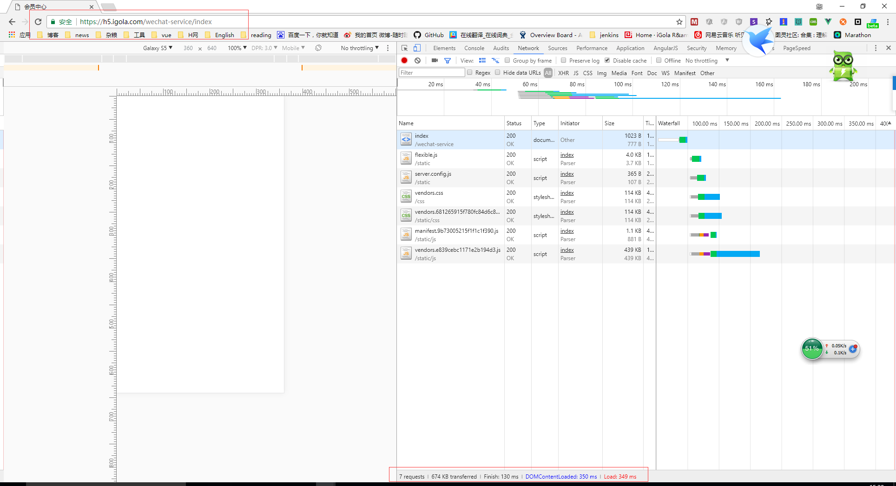
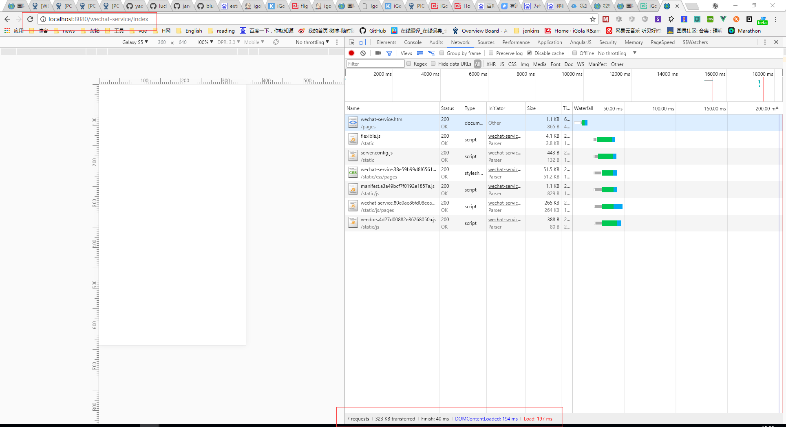

### H5构建模块拆分
在一次开发中无法设置body的样式，细查发现原来受别的模块body样式的影响。原来构建的时候将整个项目的css打包在一起，因此他们之间相互污染了。
  
> 文件夹结构不清晰,两个CSS文件夹,里面的文件都是vendors  
> 文件没按模块划分,js和css都是打包成一个文件  
> 造成的问题, 1.包体积过大,加载速度慢  2. 模块之间互相影响,容易导致未知bug  

css和js都打包成一个，方式不科学，而且目录结构不清楚，文件不能见名知意,简直就是逼死处女座。  
横批三个字:改！改！改！

改造后，把css和js都归纳在一起，根据模块名与html一一对应，其他是公共js和图片字体等静态文件,有木有一丝清凉的感觉。
### 优化前后对比
  
优化前,加载体积674K 加载完成时间130ms
  
优化后,加载体积323K 加载完成时间40ms  
> 加载体积减少108% 加载时间提升了225%

### 构建具体流程图

### 后续开发注意事项
- 路由转移到每一个模块中编写，url遵循 **/模块名/XXX** 的规则 
- 每个模块的入口文件是XXX.m.js，不加.m打包构建会出错

### 后续优化
- vuex应该拆分到各种模块
- commonChunkPlugin好像没起作用
- 提高构建速度