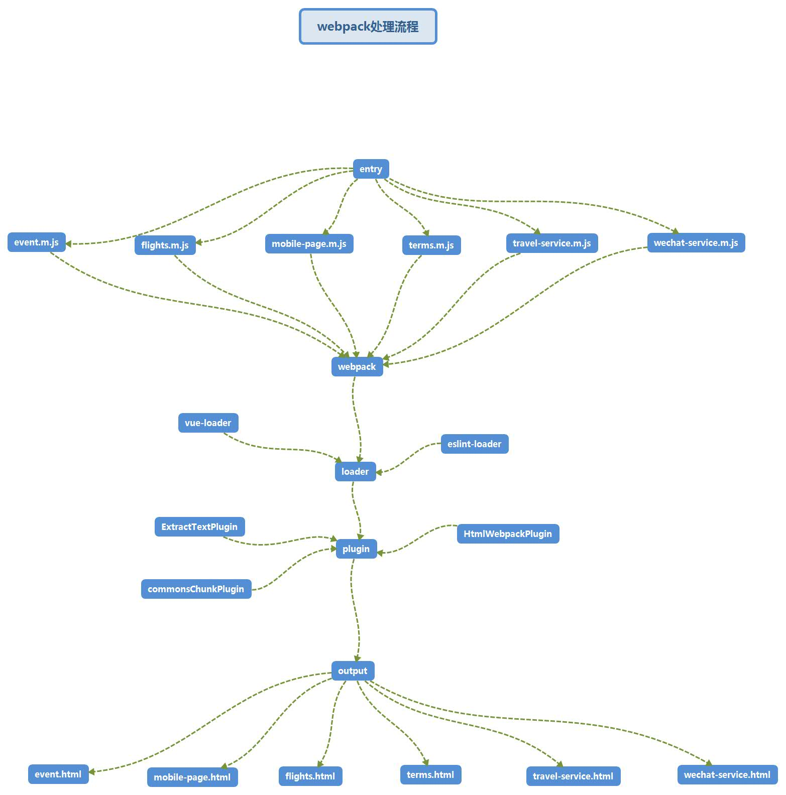

### H5构建模块拆分
在一次开发中无法设置body的样式，细查发现原来受别的模块body样式的影响。原来构建的时候将整个项目的css打包在一起，因此他们之间相互污染了。
------------图--------------
从图可以看到，css和js都打包成一个，这种方式不太科学，而且目录结构也不清楚，简直就是逼死处女座。所以，改！改！改！
-------------图--------------
改造后，把css和js都归纳在一起，再根据模块名引入到对应的html，看起来舒服多了。
### 优化前后对比

### 构建具体流程图

### 后续开发注意事项
- 路由转移到每一个模块中编写，url遵循 **/模块名/XXX** 的规则 
- 每个模块的入口文件是XXX.m.js，不加.m打包构建会出错

### 后续优化
- vuex应该拆分到各种模块
- commonChunkPlugin好像没起作用
- 提高构建速度