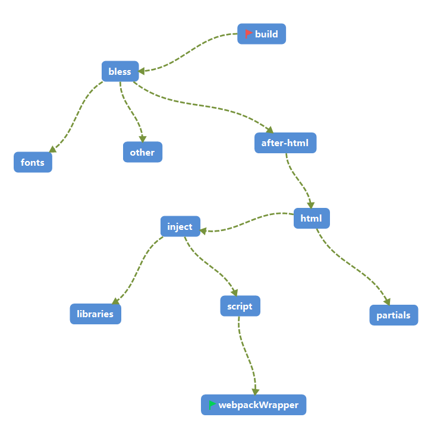

### PC构建流程

PC WEB的构建使用两个非常受欢迎的工具Gulp+Webpack,Gulp负责task任务流的构建,webpack负责模块打包.(可能有人问为什么要用Gulp?只用Webpack就可以!这个问题我也不知道,估计是历史原因吧)

#### Build任务流程图



从流程图看并不复杂,从build任务开始,到webpackWrapper结束.但从执行的顺序却是webpackWrapper进行模块打包,最后才执行build任务,与递归函数的情况有点类似,具体看下面代码
```
gulp.task('bless', ['after-html', 'fonts', 'other'], function () {
    return gulp.src(path.join(conf.paths.dist, '/styles/*.ie9.css'))
        .pipe(bless())
        .pipe(gulp.dest(path.join(conf.paths.dist, '/styles')));
});
```
在bless中,执行bless任务之前,gulp有三个任务需要执行,执行顺序从右边第一个开始,分别是other,fonts,after-html,所以整个构建流程第一个是webpackWrapper


#### 重点Task分析

- script-webpackWrapper

```
function webpackWrapper(watch, test, log, callback) {
    var entry = {};

    // 获取所有模块文件,作为入口文件给webpack进行打包
    var modules = glob.sync(path.join(conf.paths.src, '/app/**/*.module.js'));  
    modules.forEach(function(path){
        var filename = /([^\\/]+)\.module\.js$/.exec(path)[1];
        entry[filename] = './' + path;
    });

    var webpackOptions = {
        entry: entry,
        watch: watch,
        module: {
            // preLoaders: [{ test: /\.js$/, exclude: /node_modules/, loader: 'eslint-loader'}],
            loaders: [
                {
                    test: /\.js$/,
                    exclude: /node_modules/,
                    loaders: ['ng-annotate', 'babel-loader']
                },
                {
                    test: /\.css/,
                    exclude: /node_modules/,
                    loader: ExtractTextPlugin.extract("style-loader", "css-loader")
                },
                {
                    test: /\.less$/,
                    exclude: /node_modules/,
                    loader: ExtractTextPlugin.extract("style-loader", "css-loader!less-loader")
                },
                {
                    test: /\.(eot|woff|woff2|ttf|svg|png|jpe?g|gif)(\?\S*)?$/,
                    exclude: /node_modules/,
                    loader: 'url?limit=1'
                }
            ]
        },
        output: {filename: '[name].module.js'},
        plugins: [
            new ExtractTextPlugin("[name].css")
        ]
    };

    if (watch) {
        webpackOptions.devtool = 'inline-source-map';
    }
    // 监听文件改变回调方法
    var webpackChangeHandler = function (err, stats) {
        if (err) {
            conf.errorHandler('Webpack')(err);
        }
          $.util.log(stats.toString({
              colors: $.util.colors.supportsColor,
              chunks: false,
              hash: false,
              version: false
          }));

        browserSync.reload();
        if (watch) {
            watch = false;
            callback();
        }
    };

    var sources = [path.join(conf.paths.src, '/app/index/index.module.js')];

    // 打包测试文件
    if (test) {
        sources.push(path.join(conf.paths.src, '/app/**/*.spec.js'));
    }

    // 输出到.tmp文件夹里
    return gulp.src(path.join(conf.paths.src, '/app/index/index.module.js'))
        .pipe(webpack(webpackOptions, null, webpackChangeHandler))
        .pipe(gulp.dest(path.join(conf.paths.tmp, '/serve/app')));
}
```

- inject

```
gulp.task('inject', ['scripts', 'libraries'], function () {

    // 获取.tmp文件夹的css文件
    var injectStyles = function (name) {
        return gulp.src([
            path.join(conf.paths.tmp, '/serve/app/' + name + '.css'),
            path.join('!' + conf.paths.tmp, '/serve/app/vendor.css')
        ], {read: false});
    };
    // 获取.temp文件夹js的文件
    var injectScripts = function (name) {
        return gulp.src([
            path.join(conf.paths.tmp, '/serve/app/' + name + '.module.js')
        ], {read: false});
    };

    var injectOptions = {
        ignorePath: [conf.paths.src, path.join(conf.paths.tmp, '/serve')],
        addRootSlash: true,
        removeTags: true
    };

    //get all the html pages and then merge the stream
    var fileList = fs.readdirSync(conf.paths.src).filter(function(filePath){
        return /\.html$/.test(filePath);
    });

    //排除这个.tmp/serve/app/libraries

    fileList.forEach(function(filePath){
        var filename = /([^\\]+)\.html$/.exec(filePath)[1];

        streamList.push(
            gulp.src(path.join(conf.paths.src, filePath))
                .pipe($.inject(injectStyles(filename), injectOptions)) // 打入css
                .pipe($.inject(injectScripts(filename), injectOptions)) // 打入js
                .pipe(wiredep(_.extend({}, conf.wiredep))) // 打入bower的插件
                .pipe(gulp.dest(path.join(conf.paths.tmp, '/serve')))
        );
    });

    //get all the xml pages and then merge the stream
    var xmlFileList = fs.readdirSync(conf.paths.src).filter(function(filePath){
        return /\.xml$/.test(filePath);
    });
    
    // 处理xml文件
    xmlFileList.forEach(function(filePath){
        var filename = /([^\\]+)\.xml$/.exec(filePath)[1];

        streamList.push(
            gulp.src(path.join(conf.paths.src, filePath))
                .pipe($.inject(injectStyles(filename), injectOptions))
                .pipe($.inject(injectScripts(filename), injectOptions))
                .pipe(wiredep(_.extend({}, conf.wiredep)))
                .pipe(gulp.dest(path.join(conf.paths.tmp, '/serve')))
        );
    });

    return es.merge(streamList);
});
```

- html

```
gulp.task('html', ['inject', 'partials'], function () {
    // 获取所有template模板的html
    var partialsInjectFile = gulp.src(path.join(conf.paths.tmp, '/partials/templateCacheHtml.js'), {read: false});
    // 打入template模板html选项
    var partialsInjectOptions = {
        starttag: '<!-- inject:partials -->',
        ignorePath: path.join(conf.paths.tmp, '/partials'),
        addRootSlash: false
    };

    var htmlFilter = $.filter('*.html', {restore: true}); // 获取html
    var jsFilter = $.filter('**/*.js', {restore: true});  // 获取js
    var cssFilter = $.filter('**/*.css', {restore: true}); // 获取css
    var assets;

    return gulp.src(path.join(conf.paths.tmp, '/serve/*.html'))
        .pipe($.replace('/bower_components/', '../bower_components/')) //修改bower_components路径
        .pipe($.inject(partialsInjectFile, partialsInjectOptions)) // 打入
        .pipe(assets = $.useref.assets()) // 获取引用的资源
        .pipe($.rev()) // 产生一个新的md5,解决浏览器缓存问题
        .pipe(jsFilter) // 切换到JS文件
        .pipe($.uglify({ // 压缩JS文件
          mangle: false,
          compress: false
          // ,preserveComments: $.uglifySaveLicense
        })).on('error', conf.errorHandler('Uglify'))
        //  .pipe($.sourcemaps.write('maps'))
        .pipe(jsFilter.restore)
        .pipe(cssFilter) // 切换到css文件
        //    .pipe($.sourcemaps.init())
        .pipe($.replace('../../bower_components/bootstrap/fonts/', '../fonts/')) // 修改font路径
        .pipe($.minifyCss({processImport: false,compatibility: 'ie9'})) // 压缩CSS文件
        //  .pipe($.sourcemaps.write('maps'))
        .pipe(cssFilter.restore)
        .pipe(assets.restore()) 恢复引用资源
        .pipe($.useref()) // 合并页面的引用链接
        .pipe($.revReplace()) 
        .pipe(htmlFilter) // 切换到html文件
        .pipe($.minifyHtml({ // 压缩html文件
            empty: true,
            spare: true,
            quotes: true,
            conditionals: true
        }))
        .pipe(htmlFilter.restore) // 恢复原来的数据流
        .pipe(gulp.dest(path.join(conf.paths.dist, '/'))) // 讲文件输出到dist文件中
        .pipe($.size({title: path.join(conf.paths.dist, '/'), showFiles: true})); // 打印有多少个文件
});
```

