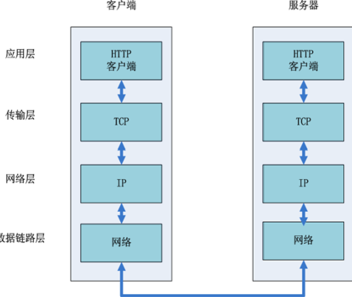
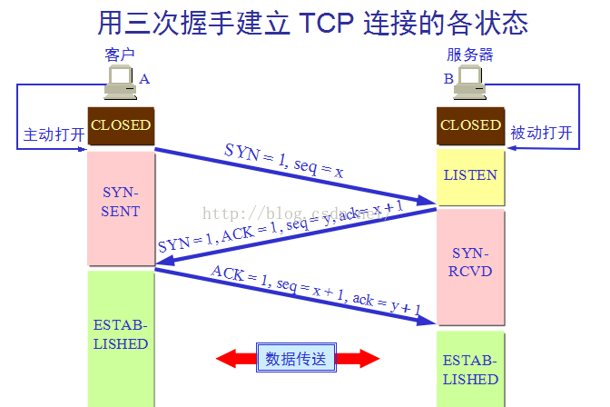

## 建立Http连接(TCP/IP)
当用户输入URL,DNS解析出IP地址,紧跟着浏览器是怎么跟服务器建立连接,中间发生了什么呢?

## TCP是什么?IP是什么?Http又是什么?
- TCP/IP是一个熟悉的名词,但我们并不知道它具体是什么?其实,它是计算机网络中的**传输层**的一个协议,IP同样如此,只不过它是属性**网络层**的,Http属于**应用层**.
- 计算机网络结构分由下到上七层,物理层/数据链路层/网络层/传输层/会话层/表示层/应用层,但是TCP/IP协议只用了四层,如下图:
  
- IP协议-主要负责根据IP寻址/传送二进制数据,但没有提供端到端的可靠传输机制
- TCP协议-通过"三次握手"与服务器建立可靠连接
- Http协议-客户端的各种请求,GET/POST/PUT/DELETE等等

## 三次握手
- 客户端和服务端建立连接,说的其实是TCP的三次握手.
- 当应用层的 HTTP 请求准备好后，浏览器会在传输层发起一条到达服务器的 TCP 连接，位于传输层的TCP协议为传输报文提供可靠的字节流服务。它为了方便传输，将大块的数据分割成以报文段为单位的数据包进行管理，并为它们编号，方便服务器接收时能准确地还原报文信息。TCP协议通过“三次握手”等方法保证传输的安全可靠。
- “三次握手”的过程是，发送端先发送一个带有SYN（synchronize）标志的数据包给接收端，在一定的延迟时间内等待接收的回复。接收端收到数据包后，传回一个带有SYN/ACK标志的数据包以示传达确认信息。接收方收到后再发送一个带有ACK标志的数据包给接收端以示握手成功。在这个过程中，如果发送端在规定延迟时间内没有收到回复则默认接收方没有收到请求，而再次发送，直到收到回复为止。
  
建立完连接后,Http请求便可畅通无阻的运行了

## Http协议
Http协议是应用层的协议,而且具有特定的标准,如果不书写不符合标准将无法识别,下面看看http的格式

### HTTP之请求消息Request
客户端发送一个HTTP请求到服务器的请求消息包括以下格式：请求行（request line）、请求头部（header）、空行和请求数据四个部分组成。

例子:
```
GET /562f25980001b1b106000338.jpg HTTP/1.1
Host    img.mukewang.com
User-Agent  Mozilla/5.0 (Windows NT 10.0; WOW64) AppleWebKit/537.36 (KHTML, like Gecko) Chrome/51.0.2704.106 Safari/537.36
Accept  image/webp,image/*,*/*;q=0.8
Referer http://www.imooc.com/
Accept-Encoding gzip, deflate, sdch
Accept-Language zh-CN,zh;q=0.8
```
- 请求行-用来说明请求类型/要访问的资源/使用的HTTP版本
- 请求头部-紧接着请求行之后的部分,用来说明服务器要使用的附加信息
- 空行-请求头部后面的空行是必须的
- 请求数据也叫主题-可以添加任意其他数据

### HTTP之响应消息Response
HTTP响应也由四个部分组成，分别是：状态行、消息报头、空行和响应正文。

例子:
```
HTTP/1.1 200 OK
Date: Fri, 22 May 2009 06:07:21 GMT
Content-Type: text/html; charset=UTF-8

<html>
      <head></head>
      <body>
            <!--body goes here-->
      </body>
</html>
```
- 状态行-由HTTP协议版本号,状态码,状态消息 三部分组成
- 消息报头-用来说明客户端要使用的一些附加信息
- 空行-消息报头后面的空行是必须的
- 响应正文-服务器返回给客户端的文本信息

### HTTP之状态码
状态代码有三位数字组成，第一个数字定义了响应的类别，共分五种类别:
- 1xx：指示信息--表示请求已接收，继续处理
- 2xx：成功--表示请求已被成功接收、理解、接受
- 3xx：重定向--要完成请求必须进行更进一步的操作
- 4xx：客户端错误--请求有语法错误或请求无法实现
- 5xx：服务器端错误--服务器未能实现合法的请求

HTTP协议定义Web客户端如何从Web服务器请求Web页面，以及服务器如何把Web页面传送给客户端。HTTP协议采用了请求/响应模型。客户端向服务器发送一个请求报文，请求报文包含请求的方法、URL、协议版本、请求头部和请求数据。服务器以一个状态行作为响应，响应的内容包括协议的版本、成功或者错误代码、服务器信息、响应头部和响应数据。

## HTTP2.0
HTTP/2比HTTP/1性能提升巨大,因为两点.
1. HTTP/2让所有数据流共用一个连接,更有效使用TCP连接,减少了TCP连接的数据和TCP慢启动的原因.
2. 多路复用,解决了http/1.1 head of line blocking,它可以发起多重请求
> 慢启动：最初的TCP在连接建立成功后会向网络中发送大量的数据包，这样很容易导致网络中路由器缓存空间耗尽，从而发生拥塞。因此新建立的连接不能够一开始就大量发送数据包，而只能根据网络情况逐步增加每次发送的数据量，以避免上述现象的发生

##参考链接
- https://www.zhihu.com/question/34074946
- https://www.jianshu.com/p/d616d887953a?utm_campaign=maleskine&utm_content=note&utm_medium=seo_notes&utm_source=recommendation
- https://www.jianshu.com/p/558455228c43