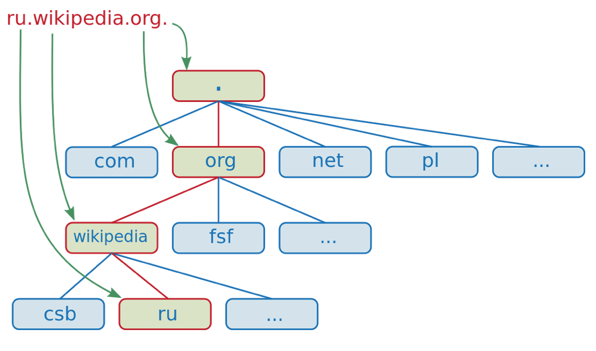

# DNS解析  
`http://lb.dev.gz.yougola.com/`和`http://192.168.0.75/`都可以访问igola,他们有什么区别?其实可以简单理解为,前者通过域名访问,后者通过IP访问.那问题来了,为什么要弄成这样?

## 用户在浏览器的地址栏中敲入了网站的网址 ，会发生哪些事情呢？
- 用户在浏览器的地址栏输入网址(一般是域名)
- 浏览器查找域名的IP地址
- 找到IP地址后,浏览器向服务器发送HTTP请求
- 服务器处理请求
- 服务器发回HTML响应
- 浏览器开始显示HTML

## 域名由来,什么是DNS?  
域名这一概念最早于1983年由保罗·莫卡派乔斯（Paul Mockapetris）发明。由于IP地址人们不容易记忆。因而产生了域名（domain name）这一种字符型标识。在实际的系统实现中，域名通过DNS（Domain Name System）系统转化为服务器的IP地址，以方便机器通过IP进行寻址和通信。

## 域名组成
了解域名解析前,有几个名词要了解一下: **根域/顶级域/二级域**

- 根域有13个服务器,分布在全世界
- 以ru.wikipedia.org为例，org为顶级域名，wikipedia为二级域名，ru为三级域名，域名树状组织结构如上图所示

## 域名解析
1. 查找浏览器缓存
> 浏览器会检查自己的缓存有没有这个域名解析过的IP,如果有,返回IP,没有转发到系统.浏览器缓存是短暂的大小也有限制 

2. 查找系统缓存
> 浏览器缓存没解析过域名,浏览器会查找操作系统缓存.在WINDOW系统,查找的是`C:\Windows\System32\drivers\etc\hosts`文件,在linux查找`/etc/hosts`,如果没有,转发到ISP DNS服务器

3. 查找ISP DNS缓存  
> ISP DNS服务器是网站设置中设置的服务器,也就是本地区的域名服务器(local DNS),服务器同样在缓存中查找域名的IP,一般到ISP DNS服务器都能完成解析工作,个别无法解析则转发到跟域服务器

4. 递归查找
> 本地服务器没办法命中DNS缓存,本地服务器就询问根域服务器,根域服务器返回`com`域服务器的IP(以`www.igola.com`为例),本地服务器继续询问`com`域服务器,`com`域返回`igola.com`域服务器的IP,本地服务器再问`igola.com`域服务器IP,`igola.com`服务器找到`www.igola.com`的IP,并返回给本地服务器,本地服务器返回给客户端浏览器,解析结束

## DNS网络优化
1. DNS预解析
```
<meta http-equiv="x-dns-prefetch-control" content="on" />
<link rel="dns-prefetch" href="http://ke.qq.com/" />
```
通过标签告诉浏览器对DNS进行预解析,还可以在APP初始化时,发出请求进行域名预解析(原理是建立缓存)

## 查看DNS解析过程
DNS的解析过程可以用`dig`命令查看
```
dig 域名 +trace
```
window的终端没有dig命令,需要安装;Mac和linux的终端都可以直接使用`dig`命令

参考文章
- http://blog.chinaunix.net/uid-28216282-id-3757849.html
- https://yq.aliyun.com/articles/58967?spm=5176.100244.teamconlist.7.WOFDYX
- http://imweb.io/topic/55e3ba46771670e207a16bc8

