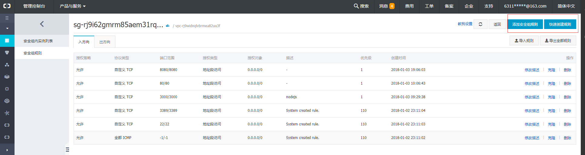

## 阿里云部署
在阿里云到服务器部署nodejs服务，服务器系统ubuntu16  

### 安装git
因为代码放在github上，因此安装git拉取代码
```
apt install git
```
 如果提升没找到包，应该先 
```
apt update
``` 

### 安装nodejs
```
apt install nodejs
```
安装的完后输入 `node -v` 查看node版本,一般node版本都比较低,为了方便安装nvm做node版本管理
```
curl -o- https://raw.githubusercontent.com/creationix/nvm/v0.31.4/install.sh | bash  
```
注意，此处需要重启terminal终端才能生效。  
使用nvm --help查看是否安装成功。   
使用nvm ls查看已经安装的版本。    
使用nvm ls-remote查看所有远端版本。  
使用nvm install安装某个版本，如nvm install v5.3.0。  
使用nvm use切换到某个版本，如nvm use v5.3.0使用5.3.0，nvm use system使用系统版本。  

安装完成后,用git拉取代码,接着起node服务,这次监听的是3000端口

### 设置阿里云服务端口
阿里云服务器对端口有特殊保护的,如果要开放端口,需要在**管理控制台**的安全组配置规则



点击右上角配置规则

根据提示填写,不行还可以点击**教我设置**查看详细的文档

设置好端口,通过IP+端口号就能访问对应的网站,比如刚刚监听了3000端口,在浏览器地址栏输入x.x.x.x:3000即可

### 域名绑定
1. 购买域名,花费9块钱
2. 实名认证,花费一天
3. 域名解析,在阿里云左侧工作栏找到域名服务,点击**解析**进行设置

4. 购买DNS云解析,花费18.36元 

## 坑
1. 一般开发的时候,127.0.0.0指的是本地.在部署时却不一样,他会指向内网的IP,因此不能使用127.0.0.0
2. 域名解析完一定要购买DNS云解析服务

